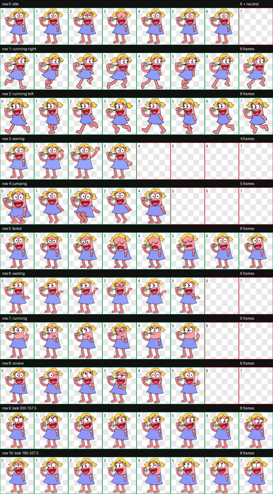

# 花花：Codex 原生桌宠

花花是一只基于 Codex v2 桌宠格式制作的动画角色。她有金色双马尾、蓝色裙子和粉色条纹四肢，会拿着小花陪你工作。



## 动作

- 待机与眨眼
- 向左、向右跑动
- 挥手和跳跃
- 等待输入、执行任务、检查结果和失败反馈
- 16 个方向的鼠标视线跟随

## 安装

需要 Windows 版 Codex，并且当前版本支持自定义桌宠。

1. 下载本仓库，或在 PowerShell 中克隆：

   ```powershell
   git clone https://github.com/JOO5216/huahua-codex-pet.git
   cd huahua-codex-pet
   ```

2. 运行安装脚本：

   ```powershell
   powershell -ExecutionPolicy Bypass -File .\install.ps1
   ```

3. 在 Codex 桌宠列表中刷新并选择“花花”。自定义桌宠 ID 为 `custom:huahua`。

也可以手动把 `pet.json` 和 `spritesheet.webp` 复制到：

```text
%USERPROFILE%\.codex\pets\huahua\
```

## 技术规格

- `spriteVersionNumber`: 2
- 图集：1536 × 2288 WebP，RGBA
- 网格：8 列 × 11 行
- 单元格：192 × 208
- 确定性图集验证：通过
- 三人隔离方向盲测：通过，带三项不影响使用的轻微警告
- 最终视觉验收：通过

完整动作预览位于 [`assets/previews`](assets/previews)，验证报告位于 [`qa/validation.json`](qa/validation.json)。

## 许可与素材说明

安装脚本和配置示例采用 MIT License。

角色图像和动画素材仅授权用于个人、学习和非商业分享。角色由用户提供的参考图二次制作；使用、转载或再发布前，请自行确认你所在地区适用的角色形象和原始素材权利。

